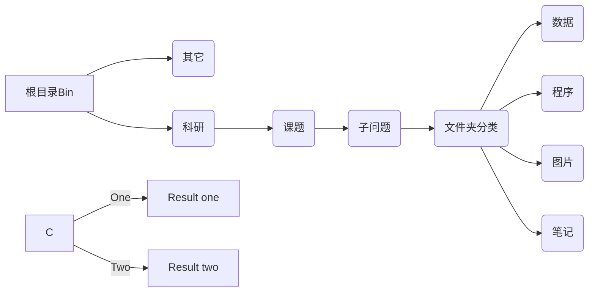

# 文件整理术[TODO]

## 粗略的设想

群分类思想

系统论交互

文件类型——软件 （一一对应）

整合：使用库功能来整合不同类型的文件，一个库即一个Project

必须容易查询——命名原则

文件树分枝结构

临时文件的处理方式

软件辅助使系统高效运转

## 流程

收集——存储——处理——备份——查找

**收集：**

1. 网络下载——浏览器
2. QQ或Wechat——下载位置
3. 程序/软件生成——xshell、Matlab、Origin etc

**存储：**

1. 硬盘(C、D、E)
2. 移动硬盘
3. U盘

**处理：**

1. 画图——To origin
2. 分析——Matlab、Excel、Mathematica
3. 压缩——右键7z
4. 比较合并——TC

**备份：**

1. 坚果云
2. 移动硬盘
3. 网盘
4. Git 版本管理

**搜索：**

1. 文件存储位置

2. 文件名及关键词@

3. Everything@搜索语法

## 目录结构[Important]

